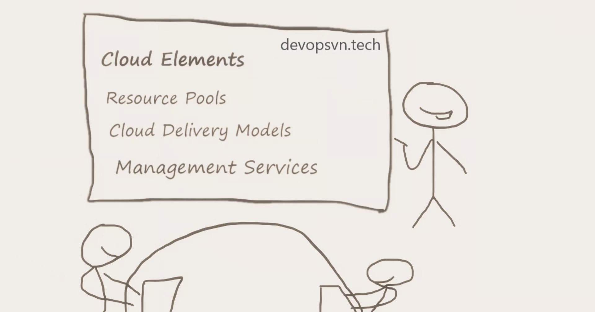
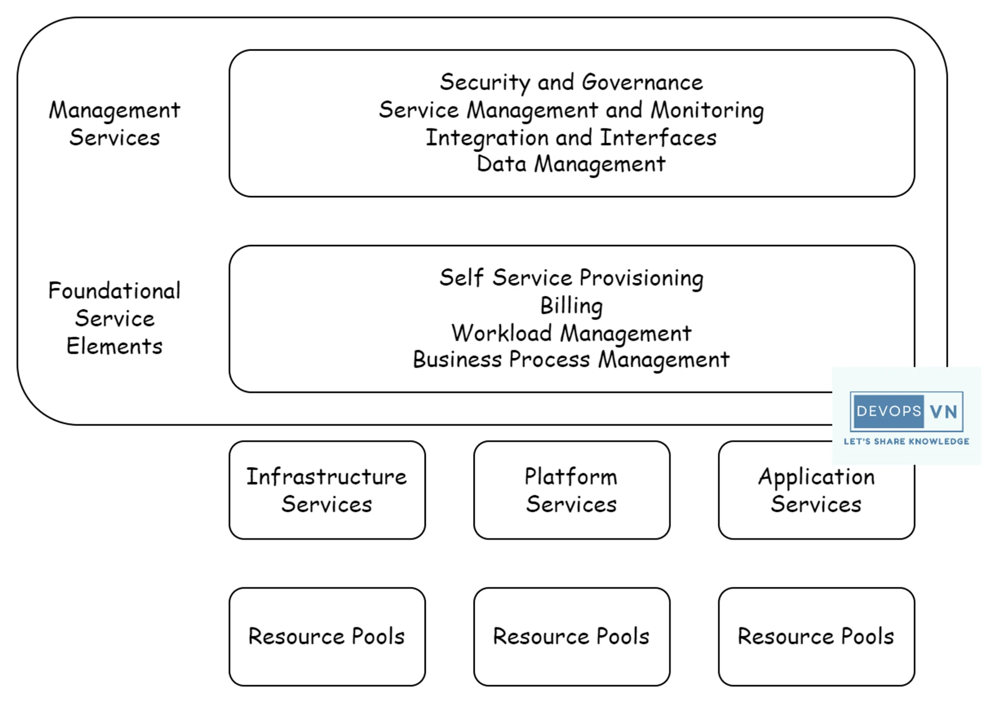
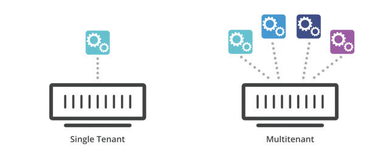
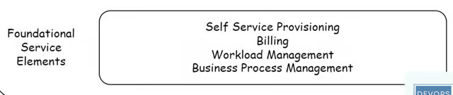
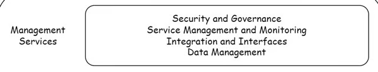

## Bài 1 - Các thành phần và đặc tính của Cloud

### Các thành phần của Cloud
Sơ đồ mô tả các thành phần chính của Cloud.

Gồm có bốn phần:

### Resource Pools
### Cloud Models
### Foundational Service Elements
### Management Services
Ta sẽ tìm hiểu từ dưới lên, bắt đầu với Resource Pools.

### Resource Pools
Resource Pools là nơi chứa các tài nguyên mà có thể chia sẻ được, đây là thành phần cơ bản nhất của Cloud.

Resource Pools được thiết kế dựa trên kiến trúc Multi-tenant Service, một kiểu kiến trúc cho phép nhiều người dùng sử dụng chung tài nguyên máy tính nhưng các cấu hình và dữ liệu của họ vẫn được tách biệt và chỉ họ mới có thể truy cập.

Với kiến trúc Multi-tenant thì các nhà cung cấp Cloud không cần phải sao chép phần mềm của mình cho từng người dùng, mà toàn bộ người dùng đều sử dụng chung phần mềm để truy cập tài nguyên trên Cloud nhưng vẫn đảm bảo dữ liệu của họ độc lập với những người dùng khác.

Và từ Resource Pools này các nhà cung cấp Cloud sẽ phân phối dịch vụ của mình thông qua các mô hình khác nhau, được gọi là Cloud Delivery Models.

### Cloud Delivery Models
Các mô hình phân phối phổ biến:

#### Infrastructure as a Service
#### Platform as a Service
#### Software as a Service
#### Infrastructure as a Service (IaaS)
IaaS là mô hình dịch vụ cung cấp hạ tầng và tài nguyên máy tính cho người dùng thông qua Internet, chỉ cần họ có Internet thì có thể yêu cầu tài nguyên để sử dụng.

Với Public Cloud người dùng chỉ đơn giản là cần Credit Card và Internet thì cho dù ở bất cứ đâu họ cũng có thể yêu cầu sử dụng tài nguyên từ Cloud, khi họ không cần sử dụng nữa thì chỉ cần tắt dịch vụ.

Với Private Cloud thì người dùng sẽ yêu cầu tài nguyên từ IT của công ty dựa trên chính sách của công ty.

#### Platform as a Service (PaaS)
PaaS là mô hình kết hợp giữa IaaS và một số dịch vụ phần mềm có sẵn để người dùng có thể triển khai ứng dụng của họ nhanh chóng nhất có thể.

Ví dụ trên AWS, khi cần triển khai một trang Web với NodeJS các bước ta cần làm là:

Tạo EC2
Truy cập EC2, cài phần mềm liên quan tới NodeJS hoặc Docker
Cấu hình Web Service như Nginx và làm rất nhiều thứ khác để NodeJS có thể chạy được
AWS có cung cấp cho ta một dịch vụ PaaS là Elastic Beanstalk có sẵn hết mọi thứ, chỉ cần một vài thao tác đơn giản trên Web Console là có được trang Web với NodeJS.

Giải thích đơn giản nhất về PaaS là IaaS mà toàn bộ phần mềm cần thiết đã có sẵn.

#### Software as a Service (SaaS)
Software as a Service là dịch vụ cung cấp phần mềm cho người dùng và người dùng trả tiền theo tháng hoặc năm để sử dụng. Ví dụ như Jira Cloud, OneDrive Cloud, Terraform Cloud, …

SaaS được đánh giá là tương lai của ngành phần mềm .

Từ Cloud Delivery Models này các nhà cung cấp Cloud sẽ xây dựng lên các đặt tính mà Cloud cần phải có để phục vụ người dùng. Được chia thành Foundational Service và Management Services.

### Foundational Service Elements

Ta sẽ nói qua hai đặc tính là Billing và Self-Service Provisioning.

#### Billing
Đây là đặc tính rất quan trọng trong Public Cloud. Người dùng sử dụng tài nguyên máy tính khi họ muốn và chỉ tính tiền những tài nguyên họ thật sự sử dụng và thời gian họ sử dụng.

Để đáp ứng được yêu cầu này thì nhà cung cấp Cloud phải thiết kế một nền tảng mà sẽ đáp ứng yêu cầu sử dụng tài nguyên của người dùng ngay lập tức khi họ cần và bắt đầu tính tiền. Khi họ không sử dụng nữa thì tài nguyên đó sẽ được trả về cho Resource Pools để các người dùng khác có thể sử dụng và ngừng tính tiền cho người dùng.

#### Self-Service Provisioning
Đây là đặc tính quan trọng tiếp theo của Cloud. Với Self-Service Provisioning thì người dùng có thể sử dụng trang Web của nhà cung cấp Cloud để chọn và sử dụng dịch vụ mà họ muốn trong chỉ một vài phút.

Ví dụ với AWS nếu ta cần máy ảo thì ta sẽ đăng nhập lên AWS Web Console và tạo EC2 để chạy máy ảo.

Với mô hình Data Center truyền thống khi ta cần máy ảo việc đầu tiên ta làm là yêu cầu tới IT, sau đó thông qua các thủ tục và thanh toán phức tạp thì yêu cầu máy ảo của ta được chấp nhận. Tiếp theo ta sẽ đợi IT cấu hình phần cứng, phần mềm và các ứng dụng liên quan. Quá trình này có thể kéo dài tới vài ngày hoặc vài tuần. Trong khi với Cloud ta chỉ mất có một vài phút.

#### Management Services

Tầng cao nhất của kiến trúc Cloud là các đặc tính đáp ứng nhu cầu cơ bản mà người dùng sẽ quan tâm bất kể họ đang sử dụng nhà cung cấp Cloud nào. Bao gồm: Security, Service Monitoring, Data Management, Integration.

Security luôn luôn là đặc tính quan trọng vì người dùng luôn yêu cầu ứng dụng và dữ liệu của họ sẽ được bảo vệ.

Service Monitoring cung cấp cho người dùng các dịch vụ giám sát có sẵn để họ biết những gì đang xảy ra với ứng dụng của họ.

Data Management cho phép người dùng di chuyển dữ liệu của họ giữa các nhà cung cấp Cloud khác nhau và cả Data Center.

Cuối cùng là đặc tính Integration, Cloud phải có các dịch vụ giúp người dùng liên kết giữa các Cloud với nhau và liên kết với Data Center để họ xây dựng được mô hình Hybrid Cloud hoặc Multi-cloud.

Kết luận
Vậy là ta đã tìm hiểu xong về các thành phần và đặc tính cơ bản mà Cloud cần phải có. Các bài tiếp theo ta sẽ nói về các tiêu chuẩn và cách quản lý môi trường Cloud.

src: https://devopsvn.tech/cloud-computing/bai-1-cac-thanh-phan-va-dac-tinh-cua-cloud
