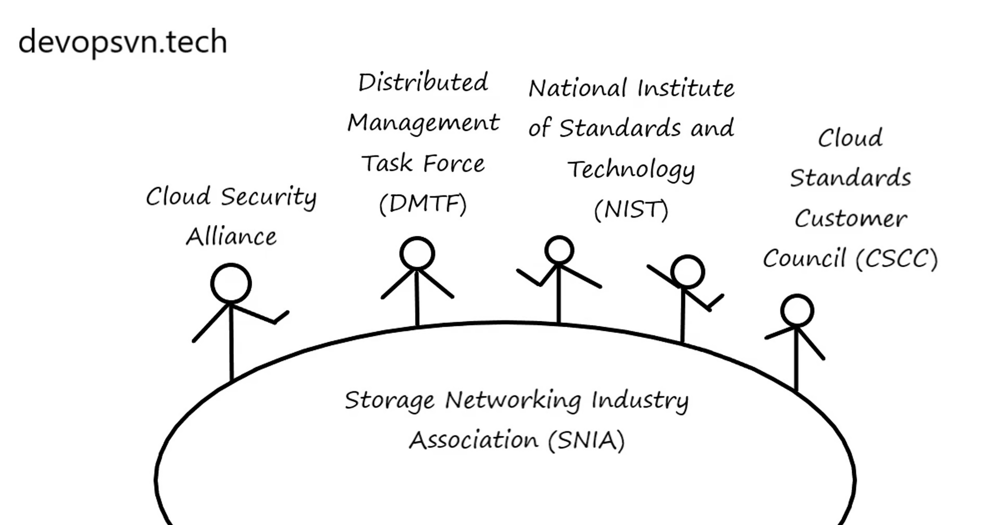

## Bài 2 - Các tổ chức xây dựng tiêu chuẩn cho Cloud

Xây dựng ứng dụng tuân thủ tiêu chuẩn cho phép các hệ thống hoạt động cùng nhau một cách dễ dàng và giảm chi phí. Tích hợp giữa các ứng dụng trong mô hình Multicloud của bạn sẽ rất khó nếu không tuân theo tiêu chuẩn nào.

### Danh mục tiêu chuẩn
Tiêu chuẩn được phát triển dựa trên các đặt tính sau: Interoperability, Portability, Security.

#### Interoperability
Interoperability (tính tương thích) là khả năng các hệ thống có thể tự do làm việc cùng nhau và chia sẻ thông tin lẫn nhau. Một trong những yếu tố quan trọng nhất của tính tương thích là khả năng cho phép ứng dụng trao đổi dữ liệu giữa các môi trường Multicloud hoặc On-prem Data Center.

Để đạt được mục tiêu tính tương thích, các nhà cung cấp Cloud cần phải có các giao diện tiêu chuẩn (Interfaces). Ví dụ, thông thường các nhà cung cấp dịch vụ Cloud sẽ phát triển một Giao diện Lập trình Ứng dụng (API) mô tả cách tài nguyên của các bạn giao tiếp với tài nguyên của Cloud.

Ví dụ hai tiêu chuẩn tính tương thích được áp dụng cho Cloud: Open Cloud Computing Interface (OCCI) và The Cloud Data Management Interface (CDMI).

#### Portability
Portability (tính di chuyển) cho phép bạn chuyển các ứng dụng hoặc dữ liệu đang được triển khai trên hệ thống của một nhà cung cấp Cloud và triển khai nó trên một nhà cung cấp khác một cách dễ dàng nhất.

Ví dụ bạn có thể chuyển máy chủ ảo của mình từ một môi trường Cloud này sang môi trường Cloud khác.

Mục tiêu của khả năng di chuyển là cho phép các thành phần của bạn (ứng dụng hoặc dữ liệu) được di chuyển giữa các nhà cung cấp khác nhau mà không cần phải sửa nhiều. Tiêu chuẩn The Cloud Data Management Interface (CDMI) đã được chấp nhận trong việc di chuyển dữ liệu giữa các Cloud.

#### Security
Security luôn luôn là vấn đề được quan tâm, bạn cần đảm bảo các công nghệ sử dụng phải bảo mật được các dữ liệu quan trọng của công ty.

### Các tổ chức xây dựng tiêu chuẩn
Dưới đây là các tổ chứ xây dựng tiêu chuẩn trên môi trường Cloud:

#### Cloud Security Alliance
#### Distributed Management Task Force (DMTF)
#### National Institute of Standards and Technology (NIST)
#### Cloud Standards Customer Council (CSCC)
#### Storage Networking Industry Association (SNIA)
Các bạn có thể bấm vào những đường dẫn trên để tìm hiểu kĩ hơn về các tổ chức.

Tại sao Cloud lại tuân theo tiêu chuẩn?
Tuân theo tiêu chuẩn sẽ giúp các nhà cung cấp Cloud các vấn đề sau:

Di chuyển cấu hình hoặc ứng dụng của bạn từ nhà cung cấp dịch vụ Cloud này sang nhà cung cấp dịch vụ Cloud khác dễ dàng. Khi Cloud tuân theo tiêu chuẩn thì ta không cần phải viết lại mã nguồn quá nhiều
Tích hợp ứng dụng dễ dàng hơn giữa các Data Center và môi trường Private Cloud hoặc Public Cloud. Các tiêu chuẩn giúp ta trong việc tích hợp dễ dàng và loại bỏ nhiều rào cản phổ biến
Tránh bị phụ thuộc vào nhà cung cấp

src: https://devopsvn.tech/cloud-computing/bai-2-cac-to-chuc-xay-dung-tieu-chuan-cho-cloud