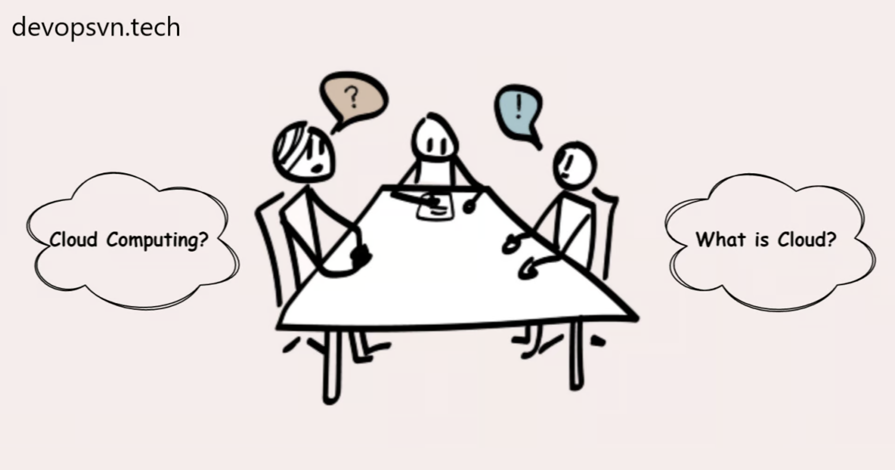
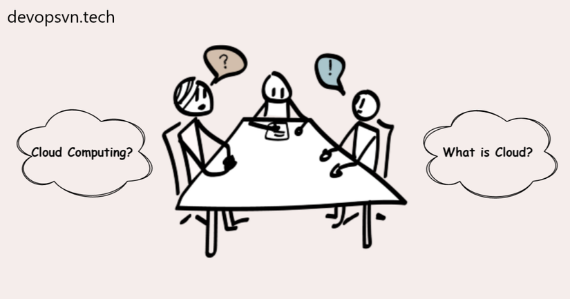
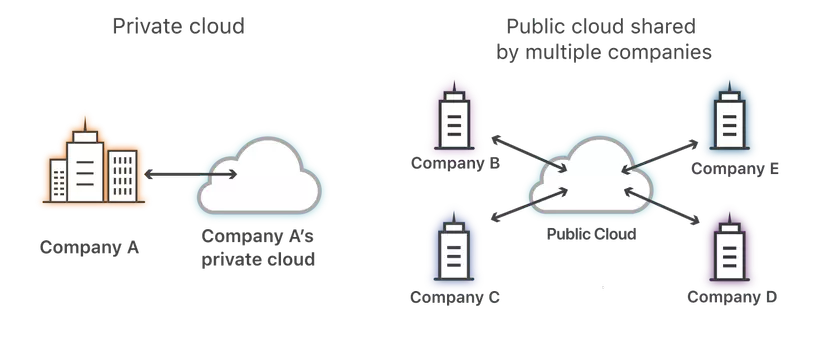

# DevOps
## Khái niệm Cloud Computing: Cloud là gì?

Cloud là một thuật ngữ mà các bạn đã nghe rất nhiều trong những năm gần đây, nó đã thay đổi hoàn toàn cách các doanh nghiệp vận hành và triển khai phần mềm. Vậy Cloud là gì? Trước khi hiểu được Cloud là gì, ta cần hiểu về khái niệm Cloud Computing.

Điện toán đám mây (Cloud Computing)
Cloud Computing là một phương pháp cung cấp tài nguyên máy tính tới người dùng một cách dễ dàng nhất, bao gồm ứng dụng, phầm mềm, phần cứng, ổ lưu trữ, kết nối mạng, …

Với Cloud Computing thì mọi thứ từ hạ tầng tới ứng dụng đều có thể được cung cấp tới người dùng dưới dạng dịch vụ thông qua Internet.

Cloud
Cloud là tập họp của nhiều tài nguyên máy tính từ phần cứng, mạng, ổ lưu trữ, ứng dụng phần mềm nằm tại các máy chủ phân bổ ở khắp nơi trên thế giới, và các máy chủ này đều sử dụng công nghệ Cloud Computing để người dùng chỉ cần có kết nối Internet thì họ có thể dễ dàng truy cập bất cứ tài nguyên nào.

Và Cloud sẽ được triển khai với các mô hình khác nhau.

Các loại mô hình của Cloud
Cloud có hai loại mô hình chính: Public Cloud và Private Cloud.

Và từ hai mô hình này ta sẽ có hai mô hình phụ nữa là: Hybrid Cloud và Multi-cloud.

Hybrid Cloud là một môi trường kết hợp giữa Public Cloud và Private Cloud cộng với Data Centers.

Multi-cloud là môi trường kết hợp giữa nhiều Public Cloud.

Public Cloud
Public Cloud là mô hình Cloud mà tài nguyên của nó có thể được sử dụng bởi bất kì ai. Public Cloud là mô hình phổ biến nhất hiện này vì bên cạnh việc cung cấp tài nguyên máy tính thì Public Cloud còn cung cấp rất nhiều các dịch vụ và ứng dụng đi kèm, giúp việc triển khai phần mềm của các doanh nghiệp càng ngày càng nhanh hơn.

Một ví dụ của Public Cloud là AWS, với AWS thì việc triển khai ứng dụng của ta rất nhanh chóng, trường hợp cụ thể là khi ta cần ứng dụng Redis thì ta không cần phải cài gì cả, AWS cung cấp cho ta dịch vụ Elasticache và chỉ cần một vài thao tác đơn giản là ta có Redis để sử dụng.

Hầu hết các nhà phát triển Public Cloud đều cung cấp cho người dùng công cụ Web Console và API để người dùng có thể dễ dàng truy cập được tài nguyên của Cloud.

Private Cloud
Private Cloud là mô hình Cloud mà tài nguyên của nó chỉ được cấp riêng cho các doanh nghiệp hoặc các nhân viên và đối tác của doanh nghiệp. Private Cloud là môi trường yêu cầu tính bảo mật cao nên thường được đặt trong tường lửa và không phải ai cũng có thể truy cập được. Private Cloud thường được phát triển và quản lý trực tiếp bởi doanh nghiệp sử dụng nó.

Ta có thể hiểu đơn giản Private Cloud là một Data Center riêng của doanh nghiệp mà có sử dụng công nghệ Cloud Computing.

Một ví dụ của Private Cloud là FPT Cloud, FPT phát triển Cloud để riêng cho bản thân doanh nghiệp và nhân viên sử dụng.

Việc doanh nghiệp tự phát triển riêng cho mình một môi trường Cloud không hề dễ dàng, tuy nhiên hiện nay thì vấn đề đó đã được giải quyết phần nào.

Sử dụng Public Cloud ở trên Data Center
Ngày nay, các nhà phát triển Public Cloud đóng gói các dịch vụ Cloud của họ lại thành các ứng dụng mà có thể cài được trên môi trường Data Center (On-premises) của doanh nghiệp.

Với điều này thì các doanh nghiệp có thể sử dụng dịch vụ Public Cloud một cách dễ dàng mà vẫn đảm bảo được bảo mật, vì dữ liệu và ứng dụng đều được chạy trên Data Center của họ.

Kết luận
Vậy là ta đã tìm hiểu xong về khái niệm Cloud Computing và Cloud. Cloud sẽ là tương lai của ngành công nghệ và chúng ta nên học để không bị lạc hậu, mình gợi ý các bạn học AWS vì đây là Cloud phổ biến nhất hiện tại. Bài tiếp theo chúng ta sẽ tìm hiểu về khái niệm Resource Pools và Cloud Models.

## Stacks
### 1. Terraform 
### 2. Ansible 
### 3. Jenkins(CI/CD) 
### 4. Docker 
### 5. K8S
